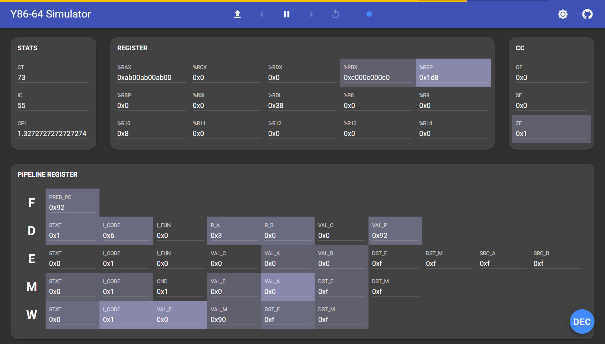

# Y86-64 Simulator

A Y86-64 processor simulator written in JavaScript, Node.js and C++11.



Y86-64 Simulator is a well-designed coursework project attached to Chap. 4 of *Computer Systems: A Programmer's Perspective, Third Edition*. For more details, please refer to *[CS:APP3e Guide to Y86-64 Processor Simulators](http://csapp.cs.cmu.edu/3e/simguide.pdf)*.

Here's a [Demo](https://sim.hakula.xyz).

## Getting Started

### 0. Prerequisites

To set up the environment, you need to have the following dependencies installed.

#### 0.1 Back-end

- [CMake](https://cmake.org/download) 2.8 or above
- [GNU make](https://www.gnu.org/software/make) 4.0 or above
- [GCC](https://gcc.gnu.org/releases.html) 4.8 or above

For Windows, try [MinGW-w64](https://sourceforge.net/projects/mingw-w64).

#### 0.2 Front-end

- [Node.js](https://nodejs.org/en/download) 12 or above

### 1. Installation

#### 1.1 Back-end

##### 1.1.1 Windows

```bash
cd lib
./install.ps1
```

##### 1.1.2 Linux

```bash
cd lib
./install.sh
```

You may need to grant yourself the execute permission using the command `chmod`.

```bash
chmod +x install.sh
```

#### 1.2 Front-end

```bash
cd app
npm install
npm run build
```

### 2. Usage

```bash
cd app
node server
```

Then check the website at <http://localhost:7273>.

To deploy and run the project on a server continuously, try [forever](https://www.npmjs.com/package/forever).

To use a command line version, see the document [here](./lib/README.md).

### 3. Clean

#### 3.1 Back-end

##### 3.1.1 Windows

```bash
cd lib
./clean.ps1
```

##### 3.1.2 Linux

```bash
cd lib
./clean.sh
```

#### 3.2 Front-end

```bash
cd app
rm -r dist/*
```

## TODO

- [x] Add a clock at a **proper** position
- [x] Implement a CPI monitor
- [ ] Implement a memory status section

## Contributors

- [**Hakula Chen**](https://github.com/hakula139)<[i@hakula.xyz](mailto:i@hakula.xyz)> - Fudan University
- [**Jiaqi Dai**](https://github.com/jqdai) - Fudan University

## License

This project is licensed under the GNU General Public License v3.0 - see the [LICENSE](./LICENSE) file for details.
